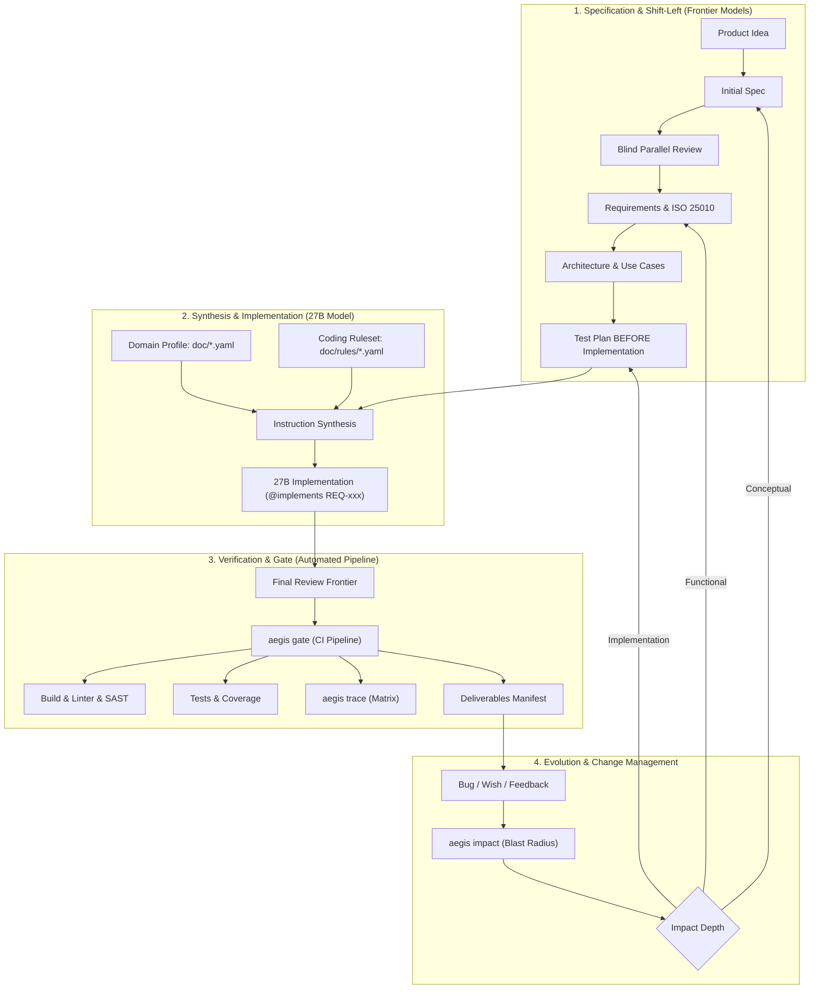

<div align="center">

# 🛡️ Aegis

**Spec-Driven Multi-Model Systems Engineering & Quality Gate Toolkit**

[](https://www.rust-lang.org)
[](LICENSE)
[](doc/dev-workflow.md)
[](doc/traceability.md)

*A rigorous, fail-closed engineering framework and standalone CLI toolkit designed for multi-agent LLM software development.*

</div>

---

## 🌟 Overview

**Aegis** bridges formal systems engineering (V-Model, Clean-Room Software Engineering, ISO 26262, DO-178C, ISO/IEC 25010) with modern agentic AI coding.

Instead of relying on fragile single-agent prompts or passive chat reviews, Aegis orchestrates a **heterogeneous multi-model pipeline**:
- **Frontier Models** (e.g. Claude 3.7 Sonnet / GPT-4.5) drive conceptual specifications, test case design, architecture, and blind parallel reviews.
- **Local / Smaller Models** (e.g. Qwen 2.5 27B / Claude Haiku) implement deterministic code constrained by strict prompts and 3-tier rulesets.
- **Aegis CLI** acts as the deterministic supervisor: verifying bidirectional traceability (`@implements` / `@verifies`), calculating blast radius for changes, managing issue lifecycles, and enforcing fail-closed CI execution gates.

---

## 🏗️ Architecture & Process



---

## ⚡ Key Features

1. **Bidirectional Traceability (`aegis trace`)**
   - Automatically tracks `Requirement -> Use Case -> Test Plan -> Source Code`.
   - Source code annotates `@implements REQ-XXX`; tests annotate `@verifies TEST-XXX`.
   - Detects **Gaps** (`GAP`) and **Orphans** (`ORPHAN`) with fail-closed exit codes.

2. **Blast-Radius Impact Analyzer (`aegis impact`)**
   - Ingests bug reports or feature requests and computes affected artifacts across docs, tests, and code.
   - Recommends impact depth (*Implementation*, *Functional*, *Conceptual*) according to ISO 26262 Part 8.

3. **Issue Lifecycle Management (`aegis issue`)**
   - Version-controlled issues in `doc/issues/ISSUE-XXXX.md` with structured YAML frontmatter.
   - Quality gates halt if unclosed `critical` or `high` severity blockers exist.

4. **Domain Profiles & 3-Tier Rulesets**
   - Declarative domain tailoring via `doc/embedded-safety.yaml` (ASIL-D / MC/DC) and `doc/enterprise.yaml`.
   - Decoupled, reusable rulesets for C11, C++, Rust, and Java operating across prompt instructions, review rubrics, and SAST linters.

5. **Interactive Dashboard**
   - Open [`doc/process-dashboard.html`](doc/process-dashboard.html) in any browser to inspect the real-time radar, ISO 25010 metrics, and interactive CLI simulator.

---

## ⚡ One-Line Bootstrap (Add Aegis to any Project)

Run this single command inside any new or existing repository to build and scaffold Aegis immediately:

```bash
# Greenfield (New Repository):
git clone --depth 1 https://github.com/schwitters/aegis.git /tmp/aegis-bin && cargo build --release --manifest-path /tmp/aegis-bin/Cargo.toml && /tmp/aegis-bin/target/release/aegis init --profile enterprise --lang rust && rm -rf /tmp/aegis-bin

# Brownfield (Existing Codebase Migration):
git clone --depth 1 https://github.com/schwitters/aegis.git /tmp/aegis-bin && cargo build --release --manifest-path /tmp/aegis-bin/Cargo.toml && /tmp/aegis-bin/target/release/aegis init --brownfield --profile enterprise --lang rust && rm -rf /tmp/aegis-bin

# Alternatively, bind as a Git Submodule:
git submodule add https://github.com/schwitters/aegis.git tools/aegis && cargo build --release --manifest-path tools/aegis/Cargo.toml && ./tools/aegis/target/release/aegis init --profile enterprise --lang rust
```

---

## 🚀 Quick Start

### 1. Build Aegis CLI Locally

```bash
# Build release binary (zero external dependencies)
cargo build --release

# Add to PATH or symlink
export PATH="$PATH:$(pwd)/target/release"
```

### 2. Verify Traceability

```bash
# Check traceability matrix and output markdown report
aegis trace --out doc/traceability.md
```

### 3. Run Blast Radius Impact Analysis

```bash
# Analyze impact of a bug or feature request
aegis impact --target REQ-001 --kind bug
```

### 4. Create and Track Issues

```bash
# Create a new issue (automatically assigns ISSUE-0001)
aegis issue create \
  --title "Buffer overflow in packet parser" \
  --type bug \
  --severity high \
  --related REQ-001

# List all open issues
aegis issue list

# Close an issue once resolved
aegis issue close ISSUE-0001
```

### 5. Execute Quality Gate

```bash
# Synthesize AGENT_INSTRUCTIONS.md for the 27B implementation model
aegis instructions --profile doc/enterprise.yaml --out AGENT_INSTRUCTIONS.md

# Run fail-closed verification pipeline against domain profile
aegis gate --profile doc/embedded-safety.yaml
```

---

## 📁 Repository Structure

```
├── doc/
│   ├── dev-workflow.md         # Full V-Model specification & DoD
│   ├── change-runbook.md       # Change management & impact protocol
│   ├── adoption-guide.md       # Greenfield & brownfield practical guide
│   ├── prompts/                # Complete Prompt Playbook (Stages 01 - 07)
│   ├── process-evaluation.md   # Architectural evaluation
│   ├── process-dashboard.html  # Interactive UI & simulator
│   ├── embedded-safety.yaml    # ISO 26262 / ASIL-D profile
│   ├── enterprise.yaml         # Cloud-native backend profile
│   ├── rules/                  # Strict language rulesets (C11, C++, Rust, Java)
│   ├── requirements/           # REQ-001.md, ...
│   ├── usecases/               # UC-001.md, ...
│   ├── testplan/               # TEST-001.md, ...
│   ├── deliverables/           # Deliverables manifest
│   └── issues/                 # ISSUE-0001.md, ...
├── tools/                      # Aegis Rust Standalone CLI
│   ├── Cargo.toml
│   ├── src/
│   └── gate.sh                 # Thin auto-building wrapper
└── README.md
```

---

## 📄 Documentation

- 📋 [Prompt Playbook & Instructions Catalog](doc/prompts/README.md)
- 🚀 [Adoption Guide (Greenfield & Brownfield)](doc/adoption-guide.md)
- 📖 [Development Workflow Specification](doc/dev-workflow.md)
- 🔄 [Change Management Runbook](doc/change-runbook.md)
- ⚖️ [Architectural Evaluation](doc/process-evaluation.md)
- 📐 [Coding Rulesets Catalog](doc/rules/README.md)
- 🛡️ [Domain Profiles Reference](doc/embedded-safety.yaml)

---

## 📜 License

Distributed under the MIT License.
