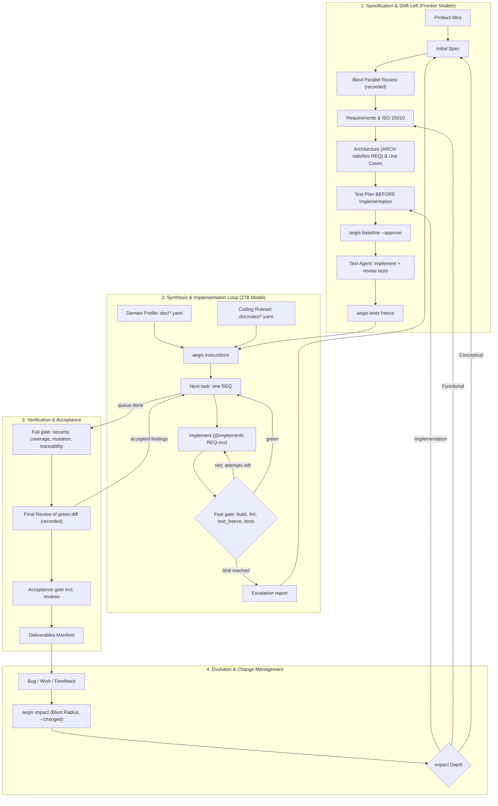

<div align="center">

# 🛡️ Aegis

**Spec-Driven Multi-Model Systems Engineering & Quality Gate Toolkit**

[](https://www.rust-lang.org)
[](LICENSE)
[](doc/dev-workflow.md)
[](doc/traceability.md)

*A rigorous, fail-closed engineering framework and standalone CLI toolkit designed for multi-agent LLM software development.*

</div>

---

## 🚀 Start Here: From a Specification to Working Software

**The flow in one sentence:** discuss your product with a frontier model until it writes the specification (and,
for example, an OpenAPI contract), save the files under `spec/`, and tell a coding agent to add Aegis and prepare
the project — for a local model or for a frontier model to implement.

You hand the coding agent exactly three things — everything else is in this repository:

| Input | What it is |
|---|---|
| **`spec/`** | Everything that describes the product, in the target repository: Markdown documents (any structure, any number), OpenAPI/JSON Schemas, UI prototypes (HTML, screen exports), images, diagrams, PDFs. It stays untouched and is read completely: every derived artifact cites its source (`spec/<file>.md#<anchor>`, `spec/openapi.yaml`, or a prototype directory `spec/ui/prototype/`), and `aegis spec check` proves that every section and every file is covered — or listed as an exception with a reason or an issue. |
| **Profile** | The domain rigor (see below), plus optional overlays and a project name. |
| **Aegis git URL** | `https://github.com/schwitters/aegis.git` — added as a submodule at `tools/aegis`. |

| Profile | For | Overlays |
|---|---|---|
| `web-enterprise` | Rust web applications (Axum, SQLx/SQLite), layered workspace, ASVS L2, GDPR, four handbooks | `rust-web-htmx` (htmx frontend) or `rust-web-pwa` (installable/offline frontend); none for server-rendered or SPA |
| `enterprise` | Backend services (Java/Rust/C++), maintainability and security focus | — |
| `local-first` | Desktop clients with optional self-hosted server, privacy by architecture | — |
| `embedded-safety` | Safety-critical firmware (ISO 26262, ASIL-D, MC/DC) | — |

### Step 0 — Write the specification (chat with a frontier model)

Discuss the idea with a frontier model until it is precise, then let it write the files. A starting prompt:

```text
I want to build <product idea, users, problem>. Interview me until the scope is clear: users and roles, core use
cases, data and its sensitivity, integrations, quality targets with numbers (latency, availability, limits),
security and privacy requirements, deployment, explicit non-goals. Challenge vague answers.
When I say "write it", produce:
- spec/01-product.md       problem, users/roles, scope, non-goals, glossary
- spec/02-use-cases.md     one heading per use case: actor, trigger, main flow, edge cases
- spec/03-quality.md       measurable non-functional requirements (ISO/IEC 25010 axes), security, privacy
- spec/04-architecture.md  technology choices and constraints, external systems, data model sketch
- spec/openapi.yaml        OpenAPI 3.1 contract of the JSON API (if there is one)
- spec/ui/                 UI prototype (static HTML/CSS per screen) or screen sketches, if we designed screens
- spec/99-open-questions.md everything still undecided
Use one heading per topic (headings become citable anchors) and never invent numbers — list them as open questions.
```

Save the files under `spec/` in a new (or existing) repository and commit them — add anything else that describes
the product (prototypes from a design tool, screenshots, PDFs). The headings matter: each Markdown heading, each
other file and each prototype directory becomes a unit that a requirement, architecture element or use case must
cite. Work packets later list these sources, so the implementing model can open the prototype of its screen.

### Step 1 — Aegis integration (frontier model with shell access)

```text
Bring this repository under the Aegis process.
- Specification: spec/   (never edit it)
- Profile: web-enterprise   Overlays: rust-web-pwa   Project name: myshop
- Aegis: https://github.com/schwitters/aegis.git

Add Aegis as a git submodule at tools/aegis and build it. Then read tools/aegis/doc/prompts/00_spec_import.md and
execute "Run 1" exactly as written, using the profile, overlays and project name above. Stop where Run 1 says STOP
and report the command outputs verbatim.
```

The agent adds Aegis, scaffolds the project (`aegis init`), translates `spec/` into requirements, architecture, use
cases and test plan under `doc/`, and proves completeness deterministically (`aegis spec check`, `aegis trace`).

**You:** let a *different* model review the artifacts blindly ([Prompt 02](doc/prompts/02_blind_spec_review.md), one
review record per stage), disposition the findings, then approve: `tools/aegis/target/release/aegis baseline --approve <your-name>`.

### Step 2 — Tests and work packets (same or another frontier model)

```text
The baseline is approved. Read tools/aegis/doc/prompts/00_spec_import.md and execute "Run 2" up to its first STOP.
```

**You:** review the tests (they must fail against stubs), then freeze them: `tools/aegis/target/release/aegis tests freeze`.

```text
The tests are frozen. Continue "Run 2" of tools/aegis/doc/prompts/00_spec_import.md from step 5.
```

`aegis tasks` now generates one self-contained packet per requirement in `doc/tasks/`, ordered by architecture layer.

### Step 3 — Implementation (local model or frontier model in an agent harness)

The packets are written for the weakest model you intend to use (budget: `agent_loop.max_task_tokens` in the profile).
A local model (e.g. 27B–32B) works through them with the fast gate and escalates when stuck (`aegis escalate`); a
frontier model can take the same queue with a larger budget and fewer escalations — the gates and frozen tests are
identical either way.

```text
Read AGENT_INSTRUCTIONS.md and doc/tasks/README.md. Work through the task queue in order, one TASK file at a time,
exactly as the file describes: implement, run its fast-gate command, fix, and stop with an escalation report when
its iteration limit is reached. Never edit doc/, the frozen tests or tools/aegis.
```

Configure the harness guardrails listed at the end of `doc/tasks/README.md` first. Then: full gate
(`aegis gate --profile doc/profile.yaml --skip reviews`), final review of the green diff by a frontier model
([Prompt 07](doc/prompts/07_final_review.md)), acceptance gate (`aegis gate --profile doc/profile.yaml`).

**Your decisions in the whole flow:** profile choice · blind reviews dispositioned · `baseline --approve` · test
review + `tests freeze` · escalations · final review. Everything else is generated or checked by Aegis.

---

## 🌟 Overview

**Aegis** bridges formal systems engineering (V-Model, Clean-Room Software Engineering, ISO 26262, DO-178C, ISO/IEC 25010) with modern agentic AI coding.

Instead of relying on fragile single-agent prompts or passive chat reviews, Aegis orchestrates a **heterogeneous multi-model pipeline**:
- **Frontier Models** (e.g. Claude 3.7 Sonnet / GPT-4.5) drive conceptual specifications, test case design, architecture, and blind parallel reviews.
- **Local / Smaller Models** (e.g. Qwen 2.5 27B / Claude Haiku) implement deterministic code constrained by strict prompts and 3-tier rulesets.
- **Test Agents** implement the test plan *before* the production code; the tests are reviewed and frozen, so the implementation model cannot weaken them.
- **Aegis CLI** acts as the deterministic supervisor: verifying traceability (`REQ → ARCH → UC → TEST → Code`), detecting suspect links against an approved baseline, calculating blast radius for changes, recording reviews, managing issue lifecycles, and enforcing fail-closed CI execution gates.

---

## 🏗️ Architecture & Process


```mermaid
flowchart TD
    subgraph P1 ["1. Specification & Shift-Left (Frontier Models)"]
        Idea["Product Idea"] --> Spec["Initial Spec"]
        Spec --> Rev1["Blind Parallel Review (recorded)"]
        Rev1 --> Req["Requirements & ISO 25010"]
        Req --> Arch["Architecture (ARCH satisfies REQ) & Use Cases"]
        Arch --> TP["Test Plan BEFORE Implementation"]
        TP --> Base["aegis baseline --approve"]
        Base --> TI["Test Agent: implement + review tests"]
        TI --> Freeze["aegis tests freeze"]
    end

    subgraph P2 ["2. Synthesis & Implementation Loop (27B Model)"]
        Prof["Domain Profile: doc/*.yaml"] --> Comp["aegis instructions"]
        Rules["Coding Ruleset: doc/rules/*.yaml"] --> Comp
        Freeze --> Comp
        Comp --> Task["Next task: one REQ"]
        Task --> Code["Implement (@implements REQ-xxx)"]
        Code --> Fast{"Fast gate: build, lint, test_freeze, tests"}
        Fast -->|red, attempts left| Code
        Fast -->|green| Task
        Fast -->|limit reached| Esc["Escalation report"]
        Esc --> Spec
    end

    subgraph P3 ["3. Verification & Acceptance"]
        Task -->|queue done| Gate["Full gate: security, coverage, mutation, traceability"]
        Gate --> Rev2["Final Review of green diff (recorded)"]
        Rev2 -->|accepted findings| Task
        Rev2 --> Acc["Acceptance gate incl. reviews"]
        Acc --> Deliv["Deliverables Manifest"]
    end

    subgraph P4 ["4. Evolution & Change Management"]
        Feedback["Bug / Wish / Feedback"] --> Impact["aegis impact (Blast Radius, --changed)"]
        Impact --> Depth{"Impact Depth"}
        Depth -->|Implementation| TP
        Depth -->|Functional| Req
        Depth -->|Conceptual| Spec
    end

    Deliv --> Feedback
```

---

## ⚡ Key Features

1. **Traceability (`aegis trace`)**
   - Tracks `Requirement -> Architecture -> Use Case -> Test Plan -> Source Code`; integration tests verify architecture elements.
   - Source code annotates `@implements REQ-XXX`; tests annotate `@verifies TEST-XXX`; every planned test must be implemented.
   - Detects **Gaps**, **Orphans**, malformed or duplicate artifacts, and an empty specification with fail-closed exit codes.

2. **Baselines & Suspect Links (`aegis baseline`)**
   - `aegis baseline --approve <name>` records the reviewed specification in `doc/baseline.lock`.
   - A changed requirement marks every downstream ARCH/UC/TEST and code location as `SUSPECT` until re-reviewed and re-baselined.

3. **Frozen Tests & Mutation Testing (`aegis tests freeze`)**
   - Tests are written by a test agent before the code, reviewed, and frozen; the gate rejects any modification.
   - The `mutation` stage (cargo-mutants, PIT) measures whether the tests actually detect wrong code.

4. **Review Records (`aegis review`)**
   - Every blind review is a work product in `doc/reviews/` with dispositioned findings (accepted / rejected / deferred to an issue).
   - The gate enforces required independent approvals per stage, e.g. two blind architecture reviews.

5. **Blast-Radius Impact Analyzer (`aegis impact`)**
   - Ingests bug reports or feature requests and computes affected artifacts across docs, tests, and code.
   - Recommends impact depth (*Implementation*, *Functional*, *Conceptual*) according to ISO 26262 Part 8.

6. **Issue Lifecycle Management (`aegis issue`)**
   - Version-controlled issues in `doc/issues/ISSUE-XXXX.md` with structured YAML frontmatter.
   - Quality gates halt if unclosed `critical` or `high` severity blockers exist.

7. **Domain Profiles & 3-Tier Rulesets**
   - Declarative domain tailoring via `doc/embedded-safety.yaml` (ASIL-D / MC/DC), `doc/enterprise.yaml`, `doc/web-enterprise.yaml` (Rust web, ASVS L2, GDPR) and `doc/local-first.yaml`.
   - The gate executes the rulesets' toolchain commands and a deviation scan: suppressions only with permitted `AEGIS-DEVIATION` markers.
   - Handbooks: `docs/{user,operator,technical,hosting}` as separate MkDocs sites (HTML + PDF); user help under `/help`, admin help (incl. SBOM and third-party licenses) under `/admin-help` for administrators only; use-case documentation coverage is traced.
   - Rust workspaces: the `architecture` stage enforces the layer policy on the crate graph (`aegis init --profile web-enterprise --name <project>` scaffolds domain / application / storage / api / server crates).
   - Decoupled, reusable rulesets for C11, C++, Rust, and Java operating across prompt instructions, review rubrics, and SAST linters.

8. **Interactive Dashboard**
   - Open [`doc/process-dashboard.html`](doc/process-dashboard.html) in any browser to inspect the real-time radar, ISO 25010 metrics, and interactive CLI simulator.

---

## ⚡ One-Line Bootstrap (Add Aegis to any Project)

Run this single command inside any new or existing repository to build and scaffold Aegis immediately:

```bash
# Greenfield (New Repository):
git clone --depth 1 https://github.com/schwitters/aegis.git /tmp/aegis-bin && cargo build --release --manifest-path /tmp/aegis-bin/Cargo.toml && /tmp/aegis-bin/target/release/aegis init --profile enterprise --lang rust && rm -rf /tmp/aegis-bin

# Brownfield (Existing Codebase Migration):
git clone --depth 1 https://github.com/schwitters/aegis.git /tmp/aegis-bin && cargo build --release --manifest-path /tmp/aegis-bin/Cargo.toml && /tmp/aegis-bin/target/release/aegis init --brownfield --profile enterprise --lang rust && rm -rf /tmp/aegis-bin

# Alternatively, bind as a Git Submodule:
git submodule add https://github.com/schwitters/aegis.git tools/aegis && cargo build --release --manifest-path tools/aegis/Cargo.toml && ./tools/aegis/target/release/aegis init --profile enterprise --lang rust
```

---

## 🚀 Quick Start

### 1. Build Aegis CLI Locally

```bash
# Build release binary (zero external dependencies)
cargo build --release

# Add to PATH or symlink
export PATH="$PATH:$(pwd)/target/release"
```

### 2. Verify Traceability

```bash
# Check traceability matrix and output markdown report
aegis trace --out doc/traceability.md
```

### 3. Run Blast Radius Impact Analysis

```bash
# Analyze impact of a bug or feature request
aegis impact --target REQ-001 --kind bug
```

### 4. Create and Track Issues

```bash
# Create a new issue (automatically assigns ISSUE-0001)
aegis issue create \
  --title "Buffer overflow in packet parser" \
  --type bug \
  --severity high \
  --related REQ-001

# List all open issues
aegis issue list

# Close an issue once resolved
aegis issue close ISSUE-0001
```

### 5. Baseline, Freeze, Review

```bash
# Show unapproved specification changes and suspect links, then approve
aegis baseline
aegis baseline --approve alice

# Freeze the reviewed tests before implementation starts
aegis tests freeze --profile doc/profile.yaml

# Record a blind review and validate all review records
aegis review create --stage architecture --artifact doc/architecture/ARCH-001.md --reviewer model-b --author model-a
aegis review check --required spec architecture:2
```

### 6. Import an Existing Specification, Generate Work Packets

```bash
aegis spec sections            # citable anchors of spec/*.md
aegis spec check               # every section cited (source:) or excepted; writes doc/spec-coverage.md
aegis tasks --profile doc/profile.yaml   # doc/tasks/TASK-*.md in layer order (needs baseline + frozen tests)
```

### 7. Implementation Loop & Quality Gate

```bash
# Synthesize AGENT_INSTRUCTIONS.md (incl. loop protocol) for the implementation model
aegis instructions --profile doc/profile.yaml --out AGENT_INSTRUCTIONS.md

# Inner loop of the implementation model (partial run, never an acceptance)
aegis gate --profile doc/profile.yaml --only build,lint,test_freeze,tests

# Full gate before the final review, then the acceptance gate with all stages
aegis gate --profile doc/profile.yaml --skip reviews
aegis gate --profile doc/profile.yaml
```

---

## 📁 Repository Structure

```
├── doc/
│   ├── dev-workflow.md         # Full V-Model specification & DoD
│   ├── change-runbook.md       # Change management & impact protocol
│   ├── adoption-guide.md       # Greenfield & brownfield practical guide
│   ├── prompts/                # Complete Prompt Playbook (Stages 01 - 07, incl. 04b test implementation)
│   ├── process-evaluation.md   # Architectural evaluation
│   ├── process-dashboard.html  # Interactive UI & simulator
│   ├── embedded-safety.yaml    # ISO 26262 / ASIL-D profile
│   ├── enterprise.yaml         # Cloud-native backend profile
│   ├── rules/                  # Strict language rulesets (C11, C++, Rust, Java)
│   ├── requirements/           # REQ-001.md, ...
│   ├── architecture/           # ARCH-001.md, ... (satisfies: [REQ-xxx])
│   ├── usecases/               # UC-001.md, ...
│   ├── testplan/               # TEST-001.md, ... + tests.lock
│   ├── reviews/                # REVIEW-0001.md, ... (review records)
│   ├── baseline.lock           # Approved specification baseline
│   ├── deliverables/           # Deliverables manifest
│   └── issues/                 # ISSUE-0001.md, ...
├── tools/                      # Aegis Rust Standalone CLI
│   ├── Cargo.toml
│   ├── src/
│   └── gate.sh                 # Thin auto-building wrapper
└── README.md
```

---

## 📄 Documentation

- 📋 [Prompt Playbook & Instructions Catalog](doc/prompts/README.md)
- 🚀 [Adoption Guide (Greenfield & Brownfield)](doc/adoption-guide.md)
- 📖 [Development Workflow Specification](doc/dev-workflow.md)
- 🔄 [Change Management Runbook](doc/change-runbook.md)
- ⚖️ [Architectural Evaluation](doc/process-evaluation.md)
- 📐 [Coding Rulesets Catalog](doc/rules/README.md)
- 🛡️ [Domain Profiles Reference](doc/embedded-safety.yaml)

---

## 📜 License

Distributed under the MIT License.
