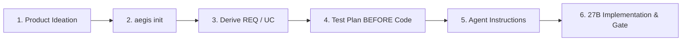
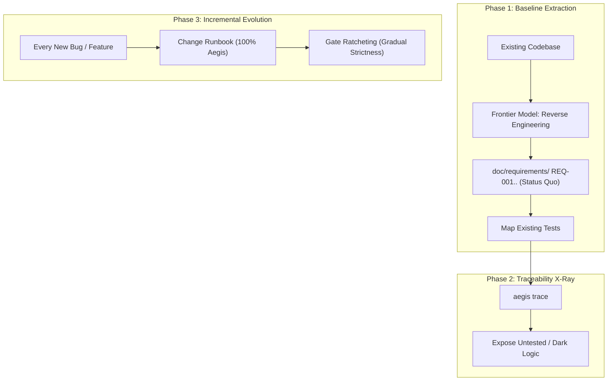

# Aegis Adoption Guide: Greenfield & Brownfield

This guide provides actionable, step-by-step instructions for adopting the Aegis systems engineering workflow:
1. **Greenfield:** Bootstrapping a brand new project from an initial specification.
2. **Brownfield:** Incrementally adopting Aegis on an existing codebase using the *Strangler Fig* migration pattern without disrupting production delivery.

---

## 🚀 Scenario A: Greenfield Project (From Scratch)

Greenfield systems adopt the full rigor of the V-Model from day one.



### Step-by-Step Procedure

### 1. Ideation & Initial Specification
Discuss the core architecture and scope with **Frontier Model A** (Claude 3.7 Sonnet / GPT-4.5). Store the result in `doc/001_initial_spec.md`.

### 2. Scaffold Repository
Run `aegis init` with your domain profile and systems language:

```bash
# For high-reliability backend / systems (Rust, C++20, Java):
aegis init --profile enterprise --lang rust

# For safety-critical firmware (C11, Embedded Rust, ASIL-D):
aegis init --profile embedded-safety --lang c
```

This creates the required directory tree (`doc/requirements/`, `doc/usecases/`, `doc/testplan/`, `doc/issues/`, `doc/rules/`, and `doc/deliverables/manifest.md`).

### 3. Requirements Derivation & Blind Parallel Review
- **Frontier Model A** derives initial requirements (`REQ-001..REQ-010`), architecture diagrams, and use cases (`UC-001..`).
- **Frontier Model B** reviews the artifacts **blindly** (without seeing Model A's rationale) against ISO/IEC 25010 axes.

### 4. Shift-Left Test Plan
Before writing implementation code:
- Model A writes test plans in `doc/testplan/TEST-xxx.md` linked to requirements (`verifies: [REQ-xxx]`).
- Model A generates `AGENT_INSTRUCTIONS.md` combining the domain profile and ruleset.

### 5. Implementation & Gate Enforcement
- The local 27B model writes the code and tests with `@implements REQ-XXX` and `@verifies TEST-XXX` annotations.
- Run `aegis gate`:

```bash
aegis gate --profile doc/profile.yaml
```

The gate verifies that all stages (Build, Linter, SAST, Tests, Traceability, Issues, Deliverables) pass cleanly before sprint completion.

---

## 🏛️ Scenario B: Brownfield Project (Legacy Migration)

Legacy systems typically have code and partial tests, but zero formal requirements and no traceability annotations. A "Big Bang" rewrite always fails.

Instead, Aegis uses **Reverse Spec Extraction** combined with the **Strangler Fig Pattern**:



### Phase 1: Initialize Brownfield Scaffolding

Run `aegis init --brownfield` inside the existing repository:

```bash
# Initialize brownfield migration scaffolding
aegis init --brownfield --lang rust --profile enterprise
```

This generates `doc/REVERSE_SPEC_EXTRACTION_PROMPT.md` and baseline requirement templates.

### Phase 2: Reverse Spec Extraction (Capture Status Quo)

Provide your Frontier model with `doc/REVERSE_SPEC_EXTRACTION_PROMPT.md` and your core modules (e.g. data structures, public API interfaces, controllers):

> **Frontier Prompt:** *"Analyze this existing codebase. Extract the 10-20 primary functional and non-functional requirements that describe what the system currently does. Formulate them as atomic `REQ-001..` documents following ISO/IEC 25010."*

Save the output in `doc/requirements/REQ-001.md`, `REQ-002.md`, etc.

### Phase 3: Traceability X-Ray

1. Tag entry point functions/structs with `@implements REQ-XXX`.
2. Tag existing unit/integration tests with `@verifies TEST-XXX`.
3. Run `aegis trace`:

```bash
aegis trace --out doc/traceability.md
```

`aegis trace` immediately provides an **architectural X-ray**:
- Identifies untracked requirements (`GAP`).
- Exposes orphaned or undocumented code paths (`ORPHAN`).
- Highlights critical business logic lacking automated verification.

### Phase 4: The Strangler Fig Rule (100% Aegis for All New Work)

Freeze legacy debt. Enforce one non-negotiable rule: **every new bug fix, refactor, or feature must go through the Change Runbook**:

1. Log issue: `aegis issue create --title "..." --type ... --severity ... --related REQ-xxx`
2. Update/create `REQ-xxx` in `doc/requirements/`.
3. Add `TEST-xxx` in `doc/testplan/` (test strictly precedes code).
4. Implement code with `@implements REQ-xxx`.
5. Verify with `aegis gate` and close issue with `aegis issue close`.

*Result:* With every commit and sprint, your legacy codebase incrementally converts to 100% auditable, type-safe, and verified systems architecture.

### Phase 5: Gate Ratcheting

Gradually tighten quality gate constraints:
- **Level 1:** Build + Unit Tests + Traceability Matrix.
- **Level 2:** Strict Linters (`clippy`, `clang-tidy`, `checkstyle`) + Security Audit (`cargo-audit`).
- **Level 3:** Enforce coverage ratcheting (50% → 70% → 85% branch coverage).
