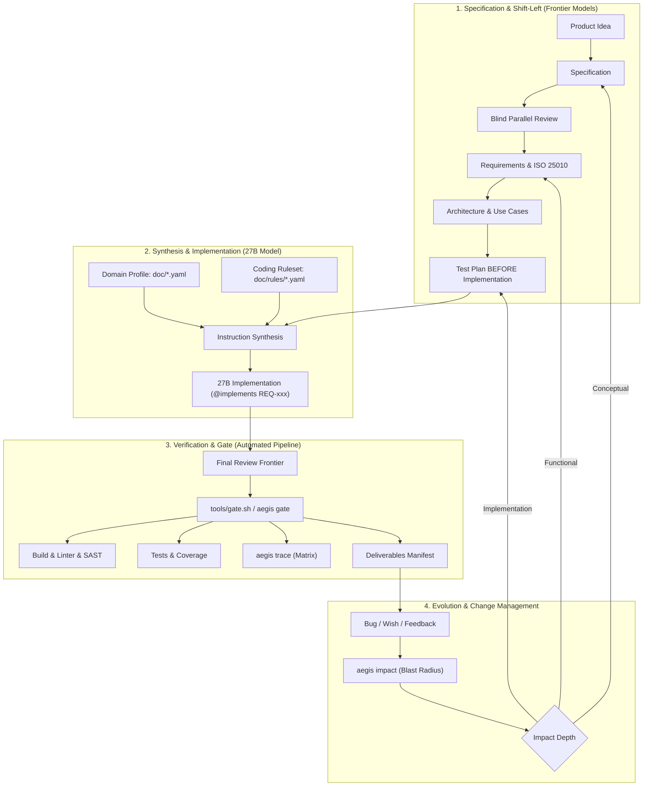

# Comprehensive Evaluation of the Aegis Development Process

A systematic architectural and methodological assessment of the **Spec-Driven Multi-Model Development Workflow** featuring profile tailoring, strict coding rulesets, bidirectional traceability, and closed-loop change management.

---

## 1. End-to-End Walkthrough of the Process

The development process merges traditional systems engineering principles (V-Model, Clean-Room, ISO 26262, DO-178C) with the capabilities and limitations of Large Language Models:

---

## 2. Detailed Dimension Analysis

### A. Model Economics & Role Segregation: 4 / 5
* **Concept:** Asymmetric division of labor. Large Frontier models handle conceptual reasoning (specification, test case design, architecture, review); a local 27B model executes deterministically.
* **Assessment:** Effectively resolves modern LLM challenges (context drift and hallucination). Frontier models must fully externalize implicit knowledge into `Agent Instructions`. What is omitted cannot be guessed.

### B. Anti-Hallucination & Verification Architecture: 4 / 5
* **Concept:** Deterministic, fail-closed execution gates (`aegis gate`, compilers, linters, test harnesses) rather than passive LLM inspection.
* **Traceability Chain:** `@implements REQ-xxx` and `@verifies TEST-xxx` establish an auditable graph $REQ \leftrightarrow UC \leftrightarrow TEST \leftrightarrow CODE$.
* **Assessment:** The fail-closed gate and automated detection of `GAP` and `ORPHAN` conditions provide high confidence. Inactive or missing toolchains result in hard failure rather than silent skips.

### C. Modularity & Tailoring (Profiles & Rulesets): 4 / 5
* **Concept:** Decoupling of **Process Core**, **Domain Rigor** (`embedded-safety.yaml`, `enterprise.yaml`), and **Language Rules** (`doc/rules/*.yaml`).
* **3-Tier Impact:** Rules act simultaneously in the prompt (27B model), in the review rubric (Frontier models), and in the linter/SAST checks (Gate).
* **Assessment:** Declarative configuration prevents process fragmentation across safety-critical and enterprise domains.

### D. Maintenance & Change Management (`doc/change-runbook.md`): 5 / 5
* **Concept:** No ad hoc code patching during maintenance. Every defect and feature request undergoes **Blast Radius Analysis** via `aegis impact` and re-enters the V-Model at the appropriate depth (*Implementation*, *Functional*, *Conceptual*).
* **Assessment:** Modeled directly after ISO 26262 Part 8 change management with step-by-step human confirmation.

---

## 3. Comparison: Typical AI Coding vs. Aegis Spec-Driven Approach

| Dimension | Typical AI Coding Approach | Aegis Spec-Driven Architecture |
|---|---|---|
| **Bug Fixing** | Ad hoc prompt-and-patch (code degrades) | Blast Radius analysis via `aegis impact`, structured re-entry |
| **Acceptance** | Passive "looks good to me" LLM chat verdict | Fail-closed Execution Gate (`aegis gate`) |
| **Requirements Validation** | Frequently overlooked or lost in chat | Formal Traceability (`aegis trace`) with gap detection |
| **Rule Enforcement** | Vague system prompts | Strict 3-tier rulesets (`doc/rules/`) with SAST integration |
| **Domain Tailoring** | Complete prompt rewrite | Declarative domain profiles (`doc/*.yaml`) |

---

## 4. Practical Risks & Mitigations

| Risk / Challenge | Root Cause | Aegis Process Mitigation |
| :--- | :--- | :--- |
| **Human Review Fatigue (HITL Fatigue)** | High volume of micro-approvals leads to rubber-stamping. | Agents provide concise diffs, blast radius summaries, and clear decision points. |
| **Parsing Sensitivity in Mixed Markdown** | Scanners capture code blocks in non-spec Markdown. | Scopes strictly bounded to `doc/requirements/`, `doc/usecases/`, `doc/testplan/`. |
| **Linter Configuration Drift** | YAML rules in `doc/rules/` diverge from native tool configs. | Single source of truth in rulesets mapped directly to linter arguments. |
| **High Safety Levels (MC/DC)** | Generic coverage tools only provide Branch/Statement coverage. | Fail-closed gate blocks completion unless a qualified project adapter is configured. |

---

## 5. Summary & Readiness

* **Status:** Reference Implementation & Production Ready Process Framework
* **Conclusion:** Aegis combines strict systems engineering discipline with cutting-edge multi-agent LLM orchestration to produce auditable, deterministic, and high-integrity software.
